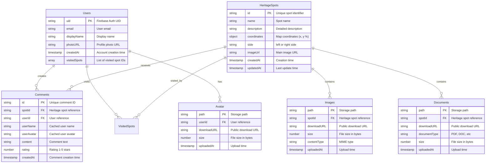
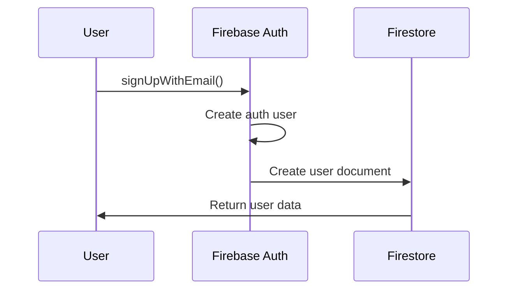
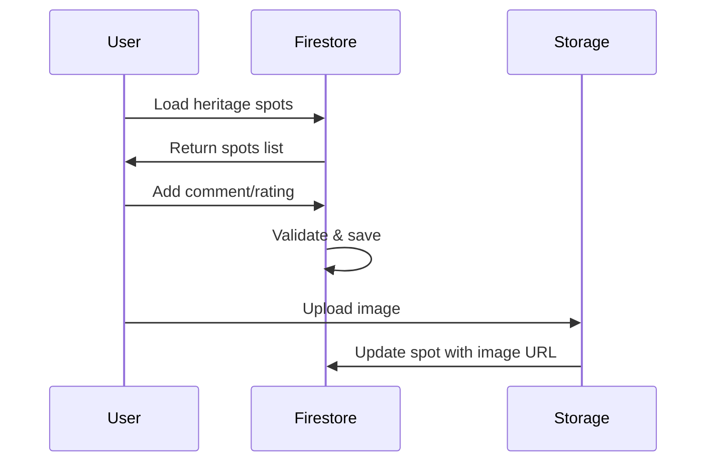
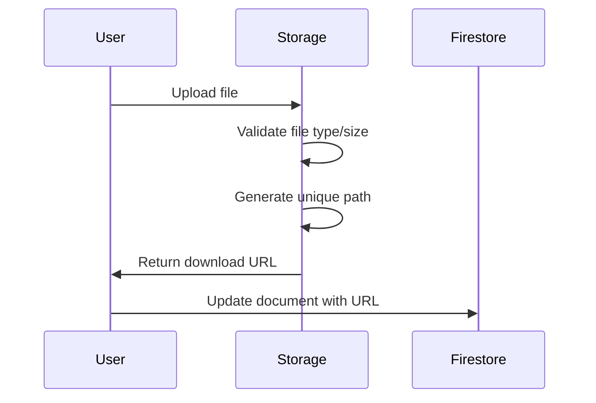

# Heritage Journey Database Architecture

## Database Structure Diagram

```mermaid
graph TB
    subgraph "Firebase Project: Heritage Journey"
        subgraph "Firestore Collections"
            HS[heritageSpots]
            U[users]
            C[comments]
            A[admin]
        end

        subgraph "Firebase Storage"
            SI[heritage-spots/{id}/images/]
            SD[heritage-spots/{id}/documents/]
            UA[users/{uid}/avatar/]
            AF[admin/files/]
        end

        subgraph "Authentication"
            AUTH[Firebase Auth]
            GP[Google Provider]
            EP[Email/Password]
        end
    end

    %% Relationships
    AUTH --> U
    U --> C
    HS --> C
    HS --> SI
    HS --> SD
    U --> UA

    %% Styling
    classDef collection fill:#e1f5fe
    classDef storage fill:#f3e5f5
    classDef auth fill:#e8f5e8

    class HS,U,C,A collection
    class SI,SD,UA,AF storage
    class AUTH,GP,EP auth
```

## Entity Relationship Diagram



## Collection Details

### 1. heritageSpots Collection

**Path:** `/heritageSpots/{spotId}`

```typescript
interface HeritageSpot {
  id: string;                    // Custom ID (e.g., "hanoi", "nghe-an")
  name: string;                  // Display name (e.g., "Hanoi")
  description: string;           // Detailed description
  coordinates: {
    x: number;                   // X coordinate (0-100%)
    y: number;                   // Y coordinate (0-100%)
  };
  side: 'left' | 'right';       // Position side on map
  imageUrl?: string;             // Main image URL from Storage
  createdAt: Timestamp;          // Creation time
  updatedAt: Timestamp;          // Last update time
}
```

**Indexes Required:**
- `side` (ascending)
- `createdAt` (descending)
- Composite: `side` + `createdAt`

### 2. users Collection

**Path:** `/users/{uid}`

```typescript
interface User {
  uid: string;                   // Firebase Auth UID
  email: string;                 // User email
  displayName?: string;          // Display name
  photoURL?: string;             // Profile photo URL
  createdAt: Timestamp;          // Account creation
  visitedSpots: string[];        // Array of heritage spot IDs
}
```

**Security:** Only accessible by the user themselves

### 3. comments Collection

**Path:** `/comments/{commentId}`

```typescript
interface Comment {
  id: string;                    // Auto-generated ID
  spotId: string;                // Reference to heritage spot
  userId: string;                // Reference to user
  userName: string;              // Cached user name
  userAvatar?: string;           // Cached user avatar URL
  content: string;               // Comment text (max 500 chars)
  rating: number;                // 1-5 star rating
  createdAt: Timestamp;          // Comment time
}
```

**Indexes Required:**
- `spotId` (ascending)
- `userId` (ascending)
- `createdAt` (descending)
- Composite: `spotId` + `createdAt`

### 4. admin Collection

**Path:** `/admin/settings`

```typescript
interface AdminSettings {
  maintenanceMode: boolean;      // App maintenance mode
  featuredSpotId: string;        // Featured heritage spot
  lastUpdated: Timestamp;        // Last admin update
}
```

**Security:** Admin only access

## Storage Structure

### Heritage Spots Files

```
/heritage-spots/
  /{spotId}/
    /images/
      /timestamp_filename.jpg
      /timestamp_filename.png
    /documents/
      /timestamp_document.pdf
      /timestamp_guide.docx
```

### User Files

```
/users/
  /{userId}/
    /avatar/
      /avatar_timestamp.jpg
```

### Admin Files

```
/admin/
  /backups/
  /exports/
  /system/
```

## Security Rules Summary

### Firestore Rules

- **heritageSpots**: Public read, authenticated write
- **users**: Private (user only)
- **comments**: Public read, authenticated write (own comments only)
- **admin**: Admin only

### Storage Rules

- **heritage-spots**: Public read, authenticated write
- **users**: Private (user only)
- **admin**: Admin only

## Data Flow Patterns

### 1. User Registration Flow



### 2. Heritage Spot Interaction



### 3. File Upload Flow



## Performance Considerations

### Indexing Strategy

1. **Single Field Indexes**
   - `heritageSpots.side`
   - `heritageSpots.createdAt`
   - `comments.spotId`
   - `comments.userId`

2. **Composite Indexes**
   - `heritageSpots`: `side` + `createdAt`
   - `comments`: `spotId` + `createdAt`
   - `comments`: `userId` + `createdAt`

### Caching Strategy

1. **Client-side caching**
   - Heritage spots list (rarely changes)
   - User profile data
   - Recently viewed comments

2. **CDN caching**
   - Heritage spot images
   - Static assets

### Query Optimization

1. **Pagination for comments**
   ```typescript
   query(collection(db, 'comments'),
     where('spotId', '==', spotId),
     orderBy('createdAt', 'desc'),
     limit(20)
   )
   ```

2. **Real-time listeners only for active data**
   ```typescript
   // Only listen to current heritage spot
   onSnapshot(doc(db, 'heritageSpots', activeSpotId), callback)
   ```

## Backup and Recovery

### Automated Backups

1. **Daily Firestore exports**
2. **Storage file replication**
3. **User data snapshots**

### Recovery Procedures

1. **Point-in-time recovery**
2. **Selective data restoration**
3. **Cross-region failover**

## Monitoring and Analytics

### Key Metrics

1. **User engagement**
   - Daily/Monthly active users
   - Heritage spots visited
   - Comments and ratings

2. **Performance metrics**
   - Query response times
   - Storage transfer rates
   - Error rates

3. **Cost monitoring**
   - Firestore reads/writes
   - Storage usage
   - Bandwidth consumption

This architecture provides a scalable, secure, and performant foundation for the Heritage Journey application while maintaining simplicity and cost-effectiveness on Firebase's Spark plan.
