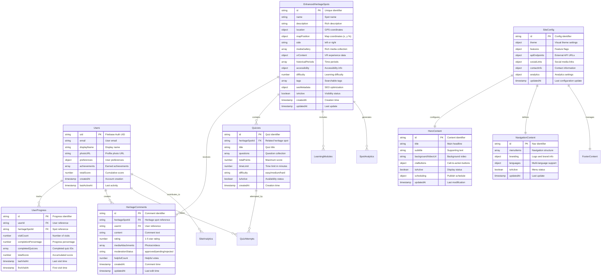

# Heritage Journey Database Architecture

## 🏗️ Firebase Dynamic Data Architecture

Kiến trúc cơ sở dữ liệu đã được thiết kế lại hoàn toàn để hỗ trợ dynamic content management với Firebase Firestore.

## Database Structure Diagram

```mermaid
graph TB
    subgraph "Firebase Project: Heritage Journey"
        subgraph "Content Management Collections"
            HC[heroContent]
            NC[navigationContent]
            FC[footerContent]
            SC[siteConfig]
            DC[documentsContent]
            VC[vrContent]
            MC[miniGameContent]
        end

        subgraph "Enhanced Heritage Collections"
            EHS[enhancedHeritageSpots]
            QZ[quizzes]
            UP[userProgress]
            CM[heritageComments]
            LM[learningModules]
        end

        subgraph "Analytics & System Collections"
            SA[siteAnalytics]
            SPA[spotAnalytics]
            SN[systemNotifications]
            CV[contentVersions]
            CS[contentSchedule]
        end

        subgraph "Firebase Storage"
            HI[heritage-spots/{id}/images/]
            HV[heritage-spots/{id}/videos/]
            HD[heritage-spots/{id}/documents/]
            HM[heritage-spots/{id}/media/]
            UA[users/{uid}/avatar/]
            AF[admin/files/]
        end

        subgraph "Authentication"
            AUTH[Firebase Auth]
            GP[Google Provider]
            EP[Email/Password]
            AA[Admin Auth]
        end
    end

    %% Content Management Relationships
    SC --> HC
    SC --> NC
    SC --> FC
    SC --> DC
    SC --> VC
    SC --> MC

    %% Heritage System Relationships
    EHS --> QZ
    EHS --> CM
    EHS --> UP
    AUTH --> UP
    AUTH --> CM

    %% Analytics Relationships
    EHS --> SPA
    UP --> SA

    %% Storage Relationships
    EHS --> HI
    EHS --> HV
    EHS --> HD
    EHS --> HM
    AUTH --> UA

    %% Styling
    classDef content fill:#e3f2fd
    classDef heritage fill:#f1f8e9
    classDef analytics fill:#fff3e0
    classDef storage fill:#f3e5f5
    classDef auth fill:#e8f5e8

    class HC,NC,FC,SC,DC,VC,MC content
    class EHS,QZ,UP,CM,LM heritage
    class SA,SPA,SN,CV,CS analytics
    class HI,HV,HD,HM,UA,AF storage
    class AUTH,GP,EP,AA auth
```

## 📋 Collections Overview

### 🎯 Content Management Collections
**Quản lý toàn bộ nội dung website động**

| Collection | Purpose | Key Features |
|------------|---------|--------------|
| `heroContent` | Nội dung trang chủ hero section | Background video, CTA buttons, text content |
| `navigationContent` | Menu và navigation items | Multi-language support, route mapping |
| `footerContent` | Footer links và contact info | Social links, company info, legal pages |
| `siteConfig` | Cấu hình chung website | Theme settings, feature flags, API endpoints |
| `documentsContent` | Quản lý tài liệu | Categories, file metadata, search indexing |
| `vrContent` | Nội dung VR experiences | 360° content, interaction points, equipment requirements |
| `miniGameContent` | Game content và scoring | Quiz questions, achievements, leaderboards |

### 🏛️ Enhanced Heritage Collections
**Hệ thống Địa điểm  nâng cao với tính năng tương tác**

| Collection | Purpose | Key Features |
|------------|---------|--------------|
| `enhancedHeritageSpots` | Điểm Địa điểm  nâng cao | Rich media, real-time data, SEO metadata |
| `quizzes` | Quiz và đánh giá kiến thức | Multiple question types, scoring, analytics |
| `userProgress` | Tiến độ học tập người dùng | Achievement tracking, learning paths |
| `heritageComments` | Bình luận và đánh giá | Moderation system, rating aggregation |
| `learningModules` | Module học tập có cấu trúc | Progressive learning, prerequisites |

### 📊 Analytics & System Collections
**Theo dõi và quản lý hệ thống**

| Collection | Purpose | Key Features |
|------------|---------|--------------|
| `siteAnalytics` | Thống kê website tổng quan | Visitor metrics, performance data |
| `spotAnalytics` | Thống kê từng điểm Địa điểm  | Popular content, user engagement |
| `systemNotifications` | Thông báo hệ thống | Real-time alerts, admin messaging |
| `contentVersions` | Versioning cho nội dung | Revision history, rollback capabilities |
| `contentSchedule` | Lên lịch phát hành nội dung | Publish scheduling, content calendar |

## Enhanced Entity Relationship Diagram



## 🔥 Real-time Features

### WebSocket Subscriptions
**Theo dõi thay đổi dữ liệu real-time**

```typescript
// Enhanced Heritage Spots Real-time Updates
const unsubscribeSpots = enhancedHeritageService.subscribeToSpots(
  (spots) => setHeritageSpots(spots)
);

// User Progress Real-time Tracking
const unsubscribeProgress = enhancedHeritageService.subscribeToUserProgress(
  userId,
  (progress) => setUserProgress(progress)
);

// Comments Real-time Updates
const unsubscribeComments = enhancedHeritageService.subscribeToComments(
  spotId,
  (comments) => setComments(comments)
);
```

### Content Management Real-time

```typescript
// Dynamic Content Updates
const unsubscribeHeroContent = contentService.subscribeToHeroContent(
  (content) => setHeroContent(content)
);

// Navigation Updates
const unsubscribeNavigation = contentService.subscribeToNavigationContent(
  (nav) => setNavigationContent(nav)
);
```

## 🚀 Performance Optimizations

### Data Fetching Strategies

| Strategy | Use Case | Implementation |
|----------|----------|----------------|
| **Real-time Subscriptions** | Live content updates | `onSnapshot()` listeners |
| **Cached Queries** | Static content | Local storage + TTL |
| **Pagination** | Large datasets | `limit()` + `startAfter()` |
| **Composite Indexes** | Complex queries | Multi-field indexes |
| **Selective Fields** | Bandwidth optimization | `select()` specific fields |

### Firebase Security Rules

```javascript
// Enhanced Security Rules
rules_version = '2';
service cloud.firestore {
  match /databases/{database}/documents {
    // Content Management - Admin only
    match /heroContent/{document} {
      allow read: if true;
      allow write: if isAdmin();
    }

    match /navigationContent/{document} {
      allow read: if true;
      allow write: if isAdmin();
    }

    // Heritage Spots - Public read, admin write
    match /enhancedHeritageSpots/{document} {
      allow read: if true;
      allow write: if isAdmin();
    }

    // User Progress - User specific
    match /userProgress/{document} {
      allow read, write: if isOwner() || isAdmin();
    }

    // Comments - Moderated
    match /heritageComments/{document} {
      allow read: if resource.data.moderationStatus == 'approved';
      allow create: if isAuthenticated() && isValidComment();
      allow update: if isOwner() || isAdmin();
    }

    // Analytics - Admin only
    match /{path=**}/analytics/{document} {
      allow read, write: if isAdmin();
    }

    function isAuthenticated() {
      return request.auth != null;
    }

    function isOwner() {
      return request.auth != null &&
             request.auth.uid == resource.data.userId;
    }

    function isAdmin() {
      return request.auth != null &&
             request.auth.token.admin == true;
    }

    function isValidComment() {
      return request.resource.data.keys().hasAll([
        'content', 'rating', 'heritageSpotId', 'userId'
      ]) && request.resource.data.content.size() > 0;
    }
  }
}
```

## 📱 Data Migration & Initialization

### Automated Data Setup
Hệ thống được thiết kế với khả năng tự động khởi tạo dữ liệu:

```bash
# Initialize development environment
yarn dev:init

# Initialize production environment
yarn prod:init

# Seed sample data
yarn seed:data
```

### Migration Scripts
- `scripts/initializeData.ts` - Tự động khởi tạo collections
- `scripts/migrateHeritageData.ts` - Migrate từ hard-coded data
- `scripts/seedSampleData.ts` - Tạo dữ liệu mẫu cho development

## 🛠️ Development Tools

### Admin Panel Features
- **Content Management**: Edit all dynamic content
- **Data Initialization**: Setup fresh environments
- **Analytics Dashboard**: Monitor site performance
- **User Management**: Handle user accounts and permissions
- **Content Scheduling**: Plan content releases

### Context Providers
- `ContentContext` - Quản lý dynamic content
- `PageContentContext` - Specialized page content
- `AuthContext` - User authentication state
- `AnalyticsContext` - Performance tracking

## 📊 Monitoring & Analytics

### Built-in Analytics
- **Site Analytics**: Page views, user sessions, bounce rate
- **Spot Analytics**: Popular heritage spots, engagement metrics
- **User Progress**: Learning completion rates, quiz scores
- **Content Performance**: Most viewed content, conversion rates

### Error Tracking
- Firebase Crashlytics integration
- Custom error boundaries
- Performance monitoring
- Real-time alerting system
        number rating "Rating 1-5 stars"
        timestamp createdAt "Comment creation time"
    }

    Images {
        string path PK "Storage path"
        string spotId FK "Heritage spot reference"
        string downloadURL "Public download URL"
        number size "File size in bytes"
        string contentType "MIME type"
        timestamp uploadedAt "Upload time"
    }

    Documents {
        string path PK "Storage path"
        string spotId FK "Heritage spot reference"
        string downloadURL "Public download URL"
        string documentType "PDF, DOC, etc"
        number size "File size in bytes"
        timestamp uploadedAt "Upload time"
    }

    Avatar {
        string path PK "Storage path"
        string userId FK "User reference"
        string downloadURL "Public download URL"
        number size "File size in bytes"
        timestamp uploadedAt "Upload time"
    }
```

## Collection Details

### 1. heritageSpots Collection

**Path:** `/heritageSpots/{spotId}`

```typescript
interface HeritageSpot {
  id: string;                    // Custom ID (e.g., "hanoi", "nghe-an")
  name: string;                  // Display name (e.g., "Hanoi")
  description: string;           // Detailed description
  coordinates: {
    x: number;                   // X coordinate (0-100%)
    y: number;                   // Y coordinate (0-100%)
  };
  side: 'left' | 'right';       // Position side on map
  imageUrl?: string;             // Main image URL from Storage
  createdAt: Timestamp;          // Creation time
  updatedAt: Timestamp;          // Last update time
}
```

**Indexes Required:**
- `side` (ascending)
- `createdAt` (descending)
- Composite: `side` + `createdAt`

### 2. users Collection

**Path:** `/users/{uid}`

```typescript
interface User {
  uid: string;                   // Firebase Auth UID
  email: string;                 // User email
  displayName?: string;          // Display name
  photoURL?: string;             // Profile photo URL
  createdAt: Timestamp;          // Account creation
  visitedSpots: string[];        // Array of heritage spot IDs
}
```

**Security:** Only accessible by the user themselves

### 3. comments Collection

**Path:** `/comments/{commentId}`

```typescript
interface Comment {
  id: string;                    // Auto-generated ID
  spotId: string;                // Reference to heritage spot
  userId: string;                // Reference to user
  userName: string;              // Cached user name
  userAvatar?: string;           // Cached user avatar URL
  content: string;               // Comment text (max 500 chars)
  rating: number;                // 1-5 star rating
  createdAt: Timestamp;          // Comment time
}
```

**Indexes Required:**
- `spotId` (ascending)
- `userId` (ascending)
- `createdAt` (descending)
- Composite: `spotId` + `createdAt`

### 4. admin Collection

**Path:** `/admin/settings`

```typescript
interface AdminSettings {
  maintenanceMode: boolean;      // App maintenance mode
  featuredSpotId: string;        // Featured heritage spot
  lastUpdated: Timestamp;        // Last admin update
}
```

**Security:** Admin only access

## Storage Structure

### Heritage Spots Files

```
/heritage-spots/
  /{spotId}/
    /images/
      /timestamp_filename.jpg
      /timestamp_filename.png
    /documents/
      /timestamp_document.pdf
      /timestamp_guide.docx
```

### User Files

```
/users/
  /{userId}/
    /avatar/
      /avatar_timestamp.jpg
```

### Admin Files

```
/admin/
  /backups/
  /exports/
  /system/
```

## Security Rules Summary

### Firestore Rules

- **heritageSpots**: Public read, authenticated write
- **users**: Private (user only)
- **comments**: Public read, authenticated write (own comments only)
- **admin**: Admin only

### Storage Rules

- **heritage-spots**: Public read, authenticated write
- **users**: Private (user only)
- **admin**: Admin only

## Data Flow Patterns

### 1. User Registration Flow


### 2. Heritage Spot Interaction


### 3. File Upload Flow


## Performance Considerations

### Indexing Strategy

1. **Single Field Indexes**
   - `heritageSpots.side`
   - `heritageSpots.createdAt`
   - `comments.spotId`
   - `comments.userId`

2. **Composite Indexes**
   - `heritageSpots`: `side` + `createdAt`
   - `comments`: `spotId` + `createdAt`
   - `comments`: `userId` + `createdAt`

### Caching Strategy

1. **Client-side caching**
   - Heritage spots list (rarely changes)
   - User profile data
   - Recently viewed comments

2. **CDN caching**
   - Heritage spot images
   - Static assets

### Query Optimization

1. **Pagination for comments**
   ```typescript
   query(collection(db, 'comments'),
     where('spotId', '==', spotId),
     orderBy('createdAt', 'desc'),
     limit(20)
   )
   ```

2. **Real-time listeners only for active data**
   ```typescript
   // Only listen to current heritage spot
   onSnapshot(doc(db, 'heritageSpots', activeSpotId), callback)
   ```

## Backup and Recovery

### Automated Backups

1. **Daily Firestore exports**
2. **Storage file replication**
3. **User data snapshots**

### Recovery Procedures

1. **Point-in-time recovery**
2. **Selective data restoration**
3. **Cross-region failover**

## Monitoring and Analytics

### Key Metrics

1. **User engagement**
   - Daily/Monthly active users
   - Heritage spots visited
   - Comments and ratings

2. **Performance metrics**
   - Query response times
   - Storage transfer rates
   - Error rates

3. **Cost monitoring**
   - Firestore reads/writes
   - Storage usage
   - Bandwidth consumption

This architecture provides a scalable, secure, and performant foundation for the Heritage Journey application while maintaining simplicity and cost-effectiveness on Firebase's Spark plan.
