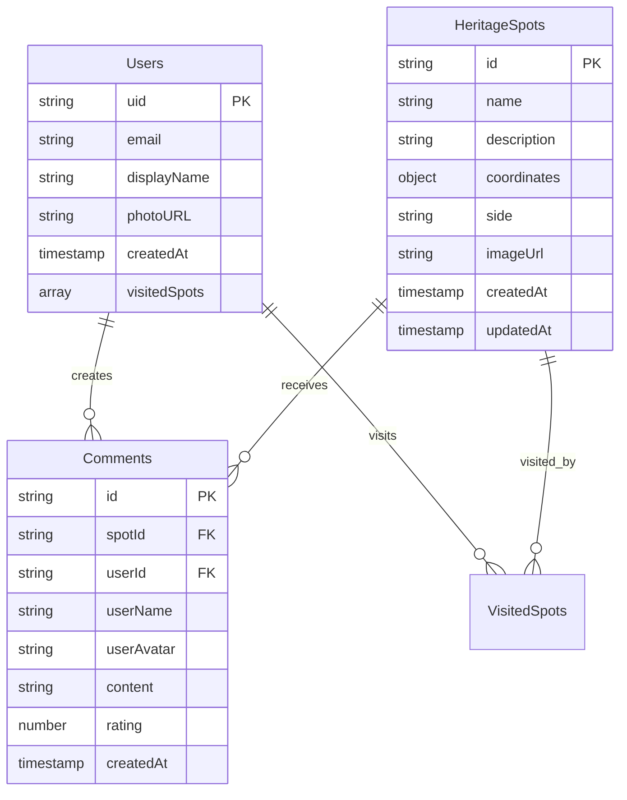

# Firebase Complete Guide - Heritage Journey App

Hướng dẫn hoàn chỉnh Firebase cho dự án Heritage Journey Following Uncle Ho, từ cơ bản đến nâng cao với Spark plan (miễn phí).

## 📋 Mục lục

0. [Database Structure & Diagram](#0-database-structure--diagram)
1. [Firestore Database](#1-firestore-database)
2. [Firebase Authentication](#2-firebase-authentication)
3. [Firebase Storage](#3-firebase-storage)
4. [Firebase Hosting](#4-firebase-hosting)
5. [Security Rules](#5-security-rules)
6. [Complete Integration Example](#6-complete-integration-example)

---

## 0. Database Structure & Diagram

### Database Collections Structure

```
📁 heritage-app (Firebase Project)
├── 🗂️ heritageSpots (Collection)
│   ├── 📄 {spotId} (Document)
│   │   ├── id: string
│   │   ├── name: string
│   │   ├── description: string
│   │   ├── coordinates: { x: number, y: number }
│   │   ├── side: 'left' | 'right'
│   │   ├── imageUrl?: string
│   │   ├── createdAt: timestamp
│   │   └── updatedAt: timestamp
│   └── ...more spots
│
├── 🗂️ users (Collection)
│   ├── 📄 {userId} (Document)
│   │   ├── uid: string
│   │   ├── email: string
│   │   ├── displayName?: string
│   │   ├── photoURL?: string
│   │   ├── createdAt: timestamp
│   │   └── visitedSpots: string[] (spotIds)
│   └── ...more users
│
├── 🗂️ comments (Collection)
│   ├── 📄 {commentId} (Document)
│   │   ├── spotId: string
│   │   ├── userId: string
│   │   ├── userName: string
│   │   ├── userAvatar?: string
│   │   ├── content: string
│   │   ├── rating: number (1-5)
│   │   └── createdAt: timestamp
│   └── ...more comments
│
└── 🗂️ admin (Collection)
    └── 📄 settings (Document)
        ├── maintenanceMode: boolean
        ├── featuredSpotId: string
        └── lastUpdated: timestamp
```

### Entity Relationship Diagram



---

## 1. Firestore Database

### 1.1 Khởi tạo Firestore

```typescript
// src/lib/firebase.ts
import { initializeApp } from 'firebase/app';
import { getFirestore } from 'firebase/firestore';
import { getAuth } from 'firebase/auth';
import { getStorage } from 'firebase/storage';

const firebaseConfig = {
  // Thay thế bằng config từ Firebase Console
  apiKey: "your-api-key",
  authDomain: "your-auth-domain",
  projectId: "your-project-id",
  storageBucket: "your-storage-bucket",
  messagingSenderId: "your-sender-id",
  appId: "your-app-id"
};

// Initialize Firebase
const app = initializeApp(firebaseConfig);

// Initialize services
export const db = getFirestore(app);
export const auth = getAuth(app);
export const storage = getStorage(app);

export default app;
```

### 1.2 Types cho Heritage Spots

```typescript
// src/types/firebase.ts
import { Timestamp } from 'firebase/firestore';

export interface FirebaseHeritageSpot {
  id: string;
  name: string;
  description: string;
  coordinates: {
    x: number;
    y: number;
  };
  side: 'left' | 'right';
  imageUrl?: string;
  createdAt: Timestamp;
  updatedAt: Timestamp;
}

export interface User {
  uid: string;
  email: string;
  displayName?: string;
  photoURL?: string;
  createdAt: Timestamp;
  visitedSpots: string[];
}

export interface Comment {
  id: string;
  spotId: string;
  userId: string;
  userName: string;
  userAvatar?: string;
  content: string;
  rating: number;
  createdAt: Timestamp;
}
```

### 1.3 CRUD Operations

#### CREATE - Thêm Heritage Spot mới

```typescript
// src/services/heritageService.ts
import {
  collection,
  addDoc,
  doc,
  setDoc,
  Timestamp
} from 'firebase/firestore';
import { db } from '../lib/firebase';
import { FirebaseHeritageSpot } from '../types/firebase';

export const addHeritageSpot = async (spotData: Omit<FirebaseHeritageSpot, 'id' | 'createdAt' | 'updatedAt'>) => {
  try {
    const spotsCollection = collection(db, 'heritageSpots');
    const docRef = await addDoc(spotsCollection, {
      ...spotData,
      createdAt: Timestamp.now(),
      updatedAt: Timestamp.now()
    });

    console.log('Heritage spot added with ID: ', docRef.id);
    return docRef.id;
  } catch (error) {
    console.error('Error adding heritage spot: ', error);
    throw error;
  }
};

// Hoặc sử dụng custom ID
export const addHeritageSpotWithId = async (id: string, spotData: Omit<FirebaseHeritageSpot, 'id' | 'createdAt' | 'updatedAt'>) => {
  try {
    const spotDoc = doc(db, 'heritageSpots', id);
    await setDoc(spotDoc, {
      id,
      ...spotData,
      createdAt: Timestamp.now(),
      updatedAt: Timestamp.now()
    });

    console.log('Heritage spot added with custom ID: ', id);
    return id;
  } catch (error) {
    console.error('Error adding heritage spot with custom ID: ', error);
    throw error;
  }
};
```

#### READ - Lấy dữ liệu Heritage Spots

```typescript
import {
  getDocs,
  getDoc,
  doc,
  query,
  where,
  orderBy,
  limit
} from 'firebase/firestore';

// Lấy tất cả heritage spots
export const getAllHeritageSpots = async (): Promise<FirebaseHeritageSpot[]> => {
  try {
    const spotsCollection = collection(db, 'heritageSpots');
    const spotsSnapshot = await getDocs(spotsCollection);

    const spots = spotsSnapshot.docs.map(doc => ({
      id: doc.id,
      ...doc.data()
    })) as FirebaseHeritageSpot[];

    return spots;
  } catch (error) {
    console.error('Error getting heritage spots: ', error);
    throw error;
  }
};

// Lấy heritage spot theo ID
export const getHeritageSpotById = async (id: string): Promise<FirebaseHeritageSpot | null> => {
  try {
    const spotDoc = doc(db, 'heritageSpots', id);
    const spotSnapshot = await getDoc(spotDoc);

    if (spotSnapshot.exists()) {
      return {
        id: spotSnapshot.id,
        ...spotSnapshot.data()
      } as FirebaseHeritageSpot;
    } else {
      console.log('No such heritage spot!');
      return null;
    }
  } catch (error) {
    console.error('Error getting heritage spot: ', error);
    throw error;
  }
};

// Query với điều kiện
export const getHeritageSpotsBySide = async (side: 'left' | 'right'): Promise<FirebaseHeritageSpot[]> => {
  try {
    const spotsCollection = collection(db, 'heritageSpots');
    const q = query(
      spotsCollection,
      where('side', '==', side),
      orderBy('createdAt', 'desc'),
      limit(10)
    );

    const querySnapshot = await getDocs(q);
    const spots = querySnapshot.docs.map(doc => ({
      id: doc.id,
      ...doc.data()
    })) as FirebaseHeritageSpot[];

    return spots;
  } catch (error) {
    console.error('Error querying heritage spots: ', error);
    throw error;
  }
};
```

#### UPDATE - Cập nhật Heritage Spot

```typescript
import { updateDoc, doc, Timestamp } from 'firebase/firestore';

export const updateHeritageSpot = async (
  id: string,
  updates: Partial<Omit<FirebaseHeritageSpot, 'id' | 'createdAt' | 'updatedAt'>>
) => {
  try {
    const spotDoc = doc(db, 'heritageSpots', id);
    await updateDoc(spotDoc, {
      ...updates,
      updatedAt: Timestamp.now()
    });

    console.log('Heritage spot updated successfully');
  } catch (error) {
    console.error('Error updating heritage spot: ', error);
    throw error;
  }
};

// Ví dụ cập nhật
// await updateHeritageSpot('hanoi', {
//   description: 'Updated description for Hanoi heritage spot'
// });
```

#### DELETE - Xóa Heritage Spot

```typescript
import { deleteDoc, doc } from 'firebase/firestore';

export const deleteHeritageSpot = async (id: string) => {
  try {
    const spotDoc = doc(db, 'heritageSpots', id);
    await deleteDoc(spotDoc);

    console.log('Heritage spot deleted successfully');
  } catch (error) {
    console.error('Error deleting heritage spot: ', error);
    throw error;
  }
};
```

### 1.4 Real-time Listeners

```typescript
import { onSnapshot, query, collection, orderBy } from 'firebase/firestore';

// Listen to real-time changes
export const subscribeToHeritageSpots = (callback: (spots: FirebaseHeritageSpot[]) => void) => {
  const spotsCollection = collection(db, 'heritageSpots');
  const q = query(spotsCollection, orderBy('createdAt', 'desc'));

  const unsubscribe = onSnapshot(q, (snapshot) => {
    const spots = snapshot.docs.map(doc => ({
      id: doc.id,
      ...doc.data()
    })) as FirebaseHeritageSpot[];

    callback(spots);
  });

  return unsubscribe; // Call this to unsubscribe
};

// Sử dụng trong React component
// useEffect(() => {
//   const unsubscribe = subscribeToHeritageSpots((spots) => {
//     setHeritageSpots(spots);
//   });
//
//   return () => unsubscribe();
// }, []);
```

---

## 2. Firebase Authentication

### 2.1 Setup Authentication

```typescript
// src/services/authService.ts
import {
  createUserWithEmailAndPassword,
  signInWithEmailAndPassword,
  signInWithPopup,
  GoogleAuthProvider,
  signOut,
  onAuthStateChanged,
  User as FirebaseUser,
  updateProfile
} from 'firebase/auth';
import { doc, setDoc, getDoc, Timestamp } from 'firebase/firestore';
import { auth, db } from '../lib/firebase';
import { User } from '../types/firebase';

// Google Provider
const googleProvider = new GoogleAuthProvider();
googleProvider.setCustomParameters({
  prompt: 'select_account'
});
```

### 2.2 Đăng ký với Email/Password

```typescript
export const signUpWithEmail = async (email: string, password: string, displayName?: string) => {
  try {
    // Tạo user trong Firebase Auth
    const userCredential = await createUserWithEmailAndPassword(auth, email, password);
    const user = userCredential.user;

    // Cập nhật profile nếu có displayName
    if (displayName) {
      await updateProfile(user, {
        displayName: displayName
      });
    }

    // Tạo user document trong Firestore
    await createUserDocument(user, { displayName });

    console.log('User signed up successfully:', user.uid);
    return user;
  } catch (error) {
    console.error('Error signing up:', error);
    throw error;
  }
};

// Tạo user document trong Firestore
const createUserDocument = async (user: FirebaseUser, additionalData?: any) => {
  if (!user) return;

  const userDoc = doc(db, 'users', user.uid);
  const userSnapshot = await getDoc(userDoc);

  if (!userSnapshot.exists()) {
    const { uid, email, displayName, photoURL } = user;

    const userData: User = {
      uid,
      email: email || '',
      displayName: displayName || additionalData?.displayName || '',
      photoURL: photoURL || '',
      createdAt: Timestamp.now(),
      visitedSpots: []
    };

    await setDoc(userDoc, userData);
    console.log('User document created in Firestore');
  }
};
```

### 2.3 Đăng nhập với Email/Password

```typescript
export const signInWithEmail = async (email: string, password: string) => {
  try {
    const userCredential = await signInWithEmailAndPassword(auth, email, password);
    const user = userCredential.user;

    console.log('User signed in successfully:', user.uid);
    return user;
  } catch (error) {
    console.error('Error signing in:', error);
    throw error;
  }
};
```

### 2.4 Đăng nhập với Google

```typescript
export const signInWithGoogle = async () => {
  try {
    const result = await signInWithPopup(auth, googleProvider);
    const user = result.user;

    // Tạo hoặc cập nhật user document trong Firestore
    await createUserDocument(user);

    console.log('User signed in with Google:', user.uid);
    return user;
  } catch (error) {
    console.error('Error signing in with Google:', error);
    throw error;
  }
};
```

### 2.5 Lấy thông tin User hiện tại

```typescript
export const getCurrentUser = (): Promise<FirebaseUser | null> => {
  return new Promise((resolve) => {
    const unsubscribe = onAuthStateChanged(auth, (user) => {
      unsubscribe();
      resolve(user);
    });
  });
};

// Lấy thông tin user từ Firestore
export const getUserData = async (uid: string): Promise<User | null> => {
  try {
    const userDoc = doc(db, 'users', uid);
    const userSnapshot = await getDoc(userDoc);

    if (userSnapshot.exists()) {
      return userSnapshot.data() as User;
    }
    return null;
  } catch (error) {
    console.error('Error getting user data:', error);
    throw error;
  }
};
```

### 2.6 Đăng xuất

```typescript
export const signOutUser = async () => {
  try {
    await signOut(auth);
    console.log('User signed out successfully');
  } catch (error) {
    console.error('Error signing out:', error);
    throw error;
  }
};
```

### 2.7 Auth Context cho React

```typescript
// src/contexts/AuthContext.tsx
import React, { createContext, useContext, useEffect, useState } from 'react';
import { User as FirebaseUser, onAuthStateChanged } from 'firebase/auth';
import { auth } from '../lib/firebase';
import { User } from '../types/firebase';
import { getUserData } from '../services/authService';

interface AuthContextType {
  currentUser: FirebaseUser | null;
  userData: User | null;
  loading: boolean;
}

const AuthContext = createContext<AuthContextType>({
  currentUser: null,
  userData: null,
  loading: true
});

export const useAuth = () => {
  const context = useContext(AuthContext);
  if (!context) {
    throw new Error('useAuth must be used within an AuthProvider');
  }
  return context;
};

export const AuthProvider: React.FC<{ children: React.ReactNode }> = ({ children }) => {
  const [currentUser, setCurrentUser] = useState<FirebaseUser | null>(null);
  const [userData, setUserData] = useState<User | null>(null);
  const [loading, setLoading] = useState(true);

  useEffect(() => {
    const unsubscribe = onAuthStateChanged(auth, async (user) => {
      setCurrentUser(user);

      if (user) {
        try {
          const data = await getUserData(user.uid);
          setUserData(data);
        } catch (error) {
          console.error('Error getting user data:', error);
        }
      } else {
        setUserData(null);
      }

      setLoading(false);
    });

    return unsubscribe;
  }, []);

  const value = {
    currentUser,
    userData,
    loading
  };

  return (
    <AuthContext.Provider value={value}>
      {!loading && children}
    </AuthContext.Provider>
  );
};
```

---

## 3. Firebase Storage

### 3.1 Upload File (Ảnh, PDF)

```typescript
// src/services/storageService.ts
import {
  ref,
  uploadBytes,
  uploadBytesResumable,
  getDownloadURL,
  deleteObject,
  listAll
} from 'firebase/storage';
import { storage } from '../lib/firebase';

export const uploadFile = async (
  file: File,
  path: string,
  onProgress?: (progress: number) => void
): Promise<string> => {
  try {
    const storageRef = ref(storage, path);

    if (onProgress) {
      // Upload với progress tracking
      const uploadTask = uploadBytesResumable(storageRef, file);

      return new Promise((resolve, reject) => {
        uploadTask.on(
          'state_changed',
          (snapshot) => {
            const progress = (snapshot.bytesTransferred / snapshot.totalBytes) * 100;
            onProgress(progress);
          },
          (error) => {
            console.error('Upload error:', error);
            reject(error);
          },
          async () => {
            try {
              const downloadURL = await getDownloadURL(uploadTask.snapshot.ref);
              console.log('File uploaded successfully:', downloadURL);
              resolve(downloadURL);
            } catch (error) {
              reject(error);
            }
          }
        );
      });
    } else {
      // Upload đơn giản
      const snapshot = await uploadBytes(storageRef, file);
      const downloadURL = await getDownloadURL(snapshot.ref);
      console.log('File uploaded successfully:', downloadURL);
      return downloadURL;
    }
  } catch (error) {
    console.error('Error uploading file:', error);
    throw error;
  }
};

// Upload ảnh cho heritage spot
export const uploadHeritageImage = async (
  file: File,
  spotId: string,
  onProgress?: (progress: number) => void
): Promise<string> => {
  const timestamp = Date.now();
  const fileName = `${timestamp}_${file.name}`;
  const path = `heritage-spots/${spotId}/${fileName}`;

  return uploadFile(file, path, onProgress);
};

// Upload avatar cho user
export const uploadUserAvatar = async (
  file: File,
  userId: string,
  onProgress?: (progress: number) => void
): Promise<string> => {
  const timestamp = Date.now();
  const fileName = `avatar_${timestamp}_${file.name}`;
  const path = `users/${userId}/${fileName}`;

  return uploadFile(file, path, onProgress);
};
```

### 3.2 Lấy URL Download

```typescript
export const getFileDownloadURL = async (path: string): Promise<string> => {
  try {
    const storageRef = ref(storage, path);
    const downloadURL = await getDownloadURL(storageRef);
    return downloadURL;
  } catch (error) {
    console.error('Error getting download URL:', error);
    throw error;
  }
};

// Lấy danh sách file trong folder
export const listFilesInFolder = async (folderPath: string) => {
  try {
    const folderRef = ref(storage, folderPath);
    const result = await listAll(folderRef);

    const files = await Promise.all(
      result.items.map(async (itemRef) => {
        const downloadURL = await getDownloadURL(itemRef);
        return {
          name: itemRef.name,
          fullPath: itemRef.fullPath,
          downloadURL
        };
      })
    );

    return files;
  } catch (error) {
    console.error('Error listing files:', error);
    throw error;
  }
};
```

### 3.3 Xóa File

```typescript
export const deleteFile = async (path: string): Promise<void> => {
  try {
    const storageRef = ref(storage, path);
    await deleteObject(storageRef);
    console.log('File deleted successfully:', path);
  } catch (error) {
    console.error('Error deleting file:', error);
    throw error;
  }
};

// Xóa tất cả ảnh của heritage spot
export const deleteHeritageImages = async (spotId: string): Promise<void> => {
  try {
    const folderRef = ref(storage, `heritage-spots/${spotId}`);
    const result = await listAll(folderRef);

    const deletePromises = result.items.map(itemRef => deleteObject(itemRef));
    await Promise.all(deletePromises);

    console.log('All heritage images deleted for spot:', spotId);
  } catch (error) {
    console.error('Error deleting heritage images:', error);
    throw error;
  }
};
```

### 3.4 File Upload Component

```typescript
// src/components/FileUpload.tsx
import React, { useState } from 'react';
import { uploadHeritageImage } from '../services/storageService';

interface FileUploadProps {
  spotId: string;
  onUploadComplete: (downloadURL: string) => void;
  onUploadError: (error: string) => void;
}

const FileUpload: React.FC<FileUploadProps> = ({
  spotId,
  onUploadComplete,
  onUploadError
}) => {
  const [uploading, setUploading] = useState(false);
  const [progress, setProgress] = useState(0);

  const handleFileUpload = async (event: React.ChangeEvent<HTMLInputElement>) => {
    const file = event.target.files?.[0];
    if (!file) return;

    // Validate file type
    const allowedTypes = ['image/jpeg', 'image/png', 'image/webp', 'application/pdf'];
    if (!allowedTypes.includes(file.type)) {
      onUploadError('Only JPEG, PNG, WebP images and PDF files are allowed');
      return;
    }

    // Validate file size (5MB max)
    const maxSize = 5 * 1024 * 1024; // 5MB
    if (file.size > maxSize) {
      onUploadError('File size must be less than 5MB');
      return;
    }

    setUploading(true);
    setProgress(0);

    try {
      const downloadURL = await uploadHeritageImage(
        file,
        spotId,
        (uploadProgress) => {
          setProgress(uploadProgress);
        }
      );

      onUploadComplete(downloadURL);
      setProgress(100);
    } catch (error) {
      onUploadError('Failed to upload file');
      console.error('Upload error:', error);
    } finally {
      setUploading(false);
    }
  };

  return (
    <div className="file-upload">
      <input
        type="file"
        accept="image/*,.pdf"
        onChange={handleFileUpload}
        disabled={uploading}
        className="block w-full text-sm text-gray-500 file:mr-4 file:py-2 file:px-4 file:rounded-full file:border-0 file:text-sm file:font-semibold file:bg-blue-50 file:text-blue-700 hover:file:bg-blue-100"
      />

      {uploading && (
        <div className="mt-2">
          <div className="bg-gray-200 rounded-full h-2.5">
            <div
              className="bg-blue-600 h-2.5 rounded-full transition-all duration-300"
              style={{ width: `${progress}%` }}
            ></div>
          </div>
          <p className="text-sm text-gray-600 mt-1">{Math.round(progress)}% uploaded</p>
        </div>
      )}
    </div>
  );
};

export default FileUpload;
```

---

## 4. Firebase Hosting

### 4.1 Setup Firebase CLI

```bash
# Cài đặt Firebase CLI
npm install -g firebase-tools

# Đăng nhập Firebase
firebase login

# Khởi tạo Firebase trong project
firebase init hosting
```

### 4.2 Configuration

```json
// firebase.json
{
  "hosting": {
    "public": "dist",
    "ignore": [
      "firebase.json",
      "**/.*",
      "**/node_modules/**"
    ],
    "rewrites": [
      {
        "source": "**",
        "destination": "/index.html"
      }
    ],
    "headers": [
      {
        "source": "**/*.@(jpg|jpeg|gif|png|svg|webp|js|css)",
        "headers": [
          {
            "key": "Cache-Control",
            "value": "max-age=31536000"
          }
        ]
      }
    ]
  }
}
```

### 4.3 Build và Deploy Scripts

```json
// package.json scripts
{
  "scripts": {
    "dev": "vite",
    "build": "vite build",
    "preview": "vite preview",
    "deploy": "npm run build && firebase deploy --only hosting",
    "deploy:preview": "npm run build && firebase hosting:channel:deploy preview"
  }
}
```

### 4.4 Deploy Commands

```bash
# Build project
npm run build

# Deploy lên production
firebase deploy --only hosting

# Deploy lên preview channel
firebase hosting:channel:deploy preview

# Deploy với custom message
firebase deploy --only hosting -m "Deploy heritage app v1.0"

# Xem hosting URL
firebase hosting:sites:list
```

### 4.5 Custom Domain (nếu có)

```bash
# Thêm custom domain
firebase hosting:sites:create your-heritage-app

# Liên kết domain
firebase target:apply hosting production your-heritage-app
firebase target:apply hosting staging your-heritage-app-staging
```

```json
// firebase.json với custom domain
{
  "hosting": [
    {
      "target": "production",
      "public": "dist",
      "rewrites": [
        {
          "source": "**",
          "destination": "/index.html"
        }
      ]
    }
  ]
}
```

---

## 5. Security Rules

### 5.1 Firestore Security Rules

```javascript
// firestore.rules
rules_version = '2';
service cloud.firestore {
  match /databases/{database}/documents {
    // Heritage Spots - Public read, authenticated write
    match /heritageSpots/{spotId} {
      allow read: if true; // Cho phép tất cả đọc
      allow write: if request.auth != null; // Chỉ user đã login mới write được
    }

    // Users - Private, chỉ user đó mới được đọc/ghi
    match /users/{userId} {
      allow read, write: if request.auth != null && request.auth.uid == userId;
    }

    // Comments - Public read, authenticated write với validation
    match /comments/{commentId} {
      allow read: if true;
      allow create: if request.auth != null
        && request.auth.uid == resource.data.userId
        && validateComment();
      allow update: if request.auth != null
        && request.auth.uid == resource.data.userId;
      allow delete: if request.auth != null
        && request.auth.uid == resource.data.userId;
    }

    // Admin collection - chỉ admin
    match /admin/{document} {
      allow read, write: if request.auth != null
        && request.auth.token.admin == true;
    }

    // Function để validate comment
    function validateComment() {
      return request.resource.data.keys().hasAll(['spotId', 'userId', 'userName', 'content', 'rating', 'createdAt'])
        && request.resource.data.content is string
        && request.resource.data.content.size() > 0
        && request.resource.data.content.size() <= 500
        && request.resource.data.rating is number
        && request.resource.data.rating >= 1
        && request.resource.data.rating <= 5;
    }
  }
}
```

### 5.2 Storage Security Rules

```javascript
// storage.rules
rules_version = '2';
service firebase.storage {
  match /b/{bucket}/o {
    // Heritage Spots images - Public read, authenticated write
    match /heritage-spots/{spotId}/{allPaths=**} {
      allow read: if true;
      allow write: if request.auth != null
        && validFileSize()
        && validFileType();
    }

    // User avatars - Private read/write
    match /users/{userId}/{allPaths=**} {
      allow read, write: if request.auth != null
        && request.auth.uid == userId
        && validFileSize()
        && validFileType();
    }

    // Validation functions
    function validFileSize() {
      return request.resource.size < 5 * 1024 * 1024; // 5MB
    }

    function validFileType() {
      return request.resource.contentType.matches('image/.*')
        || request.resource.contentType == 'application/pdf';
    }
  }
}
```

### 5.3 Deploy Security Rules

```bash
# Deploy Firestore rules
firebase deploy --only firestore:rules

# Deploy Storage rules
firebase deploy --only storage

# Deploy tất cả rules
firebase deploy --only firestore:rules,storage
```

---

## 6. Complete Integration Example

### 6.1 Heritage Spots Management Component

```typescript
// src/components/HeritageManager.tsx
import React, { useState, useEffect } from 'react';
import {
  getAllHeritageSpots,
  addHeritageSpotWithId,
  updateHeritageSpot,
  deleteHeritageSpot
} from '../services/heritageService';
import { uploadHeritageImage } from '../services/storageService';
import { FirebaseHeritageSpot } from '../types/firebase';
import { useAuth } from '../contexts/AuthContext';
import FileUpload from './FileUpload';

const HeritageManager: React.FC = () => {
  const [spots, setSpots] = useState<FirebaseHeritageSpot[]>([]);
  const [loading, setLoading] = useState(true);
  const [selectedSpot, setSelectedSpot] = useState<FirebaseHeritageSpot | null>(null);
  const { currentUser } = useAuth();

  useEffect(() => {
    loadHeritageSpots();
  }, []);

  const loadHeritageSpots = async () => {
    try {
      const heritageSpots = await getAllHeritageSpots();
      setSpots(heritageSpots);
    } catch (error) {
      console.error('Error loading heritage spots:', error);
    } finally {
      setLoading(false);
    }
  };

  const handleAddSpot = async (spotData: Omit<FirebaseHeritageSpot, 'id' | 'createdAt' | 'updatedAt'>) => {
    if (!currentUser) return;

    try {
      const id = await addHeritageSpotWithId(spotData.name.toLowerCase().replace(/\s+/g, '-'), spotData);
      await loadHeritageSpots();
      console.log('Heritage spot added:', id);
    } catch (error) {
      console.error('Error adding heritage spot:', error);
    }
  };

  const handleUpdateSpot = async (id: string, updates: Partial<FirebaseHeritageSpot>) => {
    if (!currentUser) return;

    try {
      await updateHeritageSpot(id, updates);
      await loadHeritageSpots();
      console.log('Heritage spot updated:', id);
    } catch (error) {
      console.error('Error updating heritage spot:', error);
    }
  };

  const handleDeleteSpot = async (id: string) => {
    if (!currentUser) return;

    if (window.confirm('Are you sure you want to delete this heritage spot?')) {
      try {
        await deleteHeritageSpot(id);
        await loadHeritageSpots();
        console.log('Heritage spot deleted:', id);
      } catch (error) {
        console.error('Error deleting heritage spot:', error);
      }
    }
  };

  const handleImageUpload = async (spotId: string, downloadURL: string) => {
    await handleUpdateSpot(spotId, { imageUrl: downloadURL });
  };

  if (loading) {
    return <div className="text-center py-8">Loading heritage spots...</div>;
  }

  if (!currentUser) {
    return <div className="text-center py-8">Please login to manage heritage spots.</div>;
  }

  return (
    <div className="max-w-6xl mx-auto p-6">
      <h2 className="text-3xl font-bold mb-8">Heritage Spots Management</h2>

      <div className="grid grid-cols-1 md:grid-cols-2 lg:grid-cols-3 gap-6">
        {spots.map(spot => (
          <div key={spot.id} className="bg-white rounded-lg shadow-lg p-6">
            <div className="flex justify-between items-start mb-4">
              <h3 className="text-xl font-bold text-gray-900">{spot.name}</h3>
              <button
                onClick={() => handleDeleteSpot(spot.id)}
                className="text-red-600 hover:text-red-800"
              >
                Delete
              </button>
            </div>

            {spot.imageUrl && (
              
            )}

            <p className="text-gray-600 mb-4">{spot.description}</p>

            <div className="mb-4">
              <p className="text-sm text-gray-500">
                Coordinates: {spot.coordinates.x}%, {spot.coordinates.y}%
              </p>
              <p className="text-sm text-gray-500">Side: {spot.side}</p>
            </div>

            <FileUpload
              spotId={spot.id}
              onUploadComplete={(url) => handleImageUpload(spot.id, url)}
              onUploadError={(error) => console.error('Upload error:', error)}
            />
          </div>
        ))}
      </div>
    </div>
  );
};

export default HeritageManager;
```

### 6.2 Authentication Components

```typescript
// src/components/AuthForms.tsx
import React, { useState } from 'react';
import { signUpWithEmail, signInWithEmail, signInWithGoogle } from '../services/authService';

const AuthForms: React.FC = () => {
  const [isLogin, setIsLogin] = useState(true);
  const [email, setEmail] = useState('');
  const [password, setPassword] = useState('');
  const [displayName, setDisplayName] = useState('');
  const [loading, setLoading] = useState(false);

  const handleEmailAuth = async (e: React.FormEvent) => {
    e.preventDefault();
    setLoading(true);

    try {
      if (isLogin) {
        await signInWithEmail(email, password);
      } else {
        await signUpWithEmail(email, password, displayName);
      }
      console.log('Authentication successful');
    } catch (error) {
      console.error('Authentication error:', error);
    } finally {
      setLoading(false);
    }
  };

  const handleGoogleAuth = async () => {
    setLoading(true);
    try {
      await signInWithGoogle();
      console.log('Google authentication successful');
    } catch (error) {
      console.error('Google authentication error:', error);
    } finally {
      setLoading(false);
    }
  };

  return (
    <div className="max-w-md mx-auto bg-white rounded-lg shadow-lg p-8">
      <h2 className="text-2xl font-bold mb-6 text-center">
        {isLogin ? 'Đăng nhập' : 'Đăng ký'}
      </h2>

      <form onSubmit={handleEmailAuth} className="space-y-4">
        {!isLogin && (
          <div>
            <label className="block text-sm font-medium text-gray-700 mb-1">
              Tên hiển thị
            </label>
            <input
              type="text"
              value={displayName}
              onChange={(e) => setDisplayName(e.target.value)}
              className="w-full px-3 py-2 border border-gray-300 rounded-md focus:outline-none focus:ring-2 focus:ring-blue-500"
              required={!isLogin}
            />
          </div>
        )}

        <div>
          <label className="block text-sm font-medium text-gray-700 mb-1">
            Email
          </label>
          <input
            type="email"
            value={email}
            onChange={(e) => setEmail(e.target.value)}
            className="w-full px-3 py-2 border border-gray-300 rounded-md focus:outline-none focus:ring-2 focus:ring-blue-500"
            required
          />
        </div>

        <div>
          <label className="block text-sm font-medium text-gray-700 mb-1">
            Mật khẩu
          </label>
          <input
            type="password"
            value={password}
            onChange={(e) => setPassword(e.target.value)}
            className="w-full px-3 py-2 border border-gray-300 rounded-md focus:outline-none focus:ring-2 focus:ring-blue-500"
            required
            minLength={6}
          />
        </div>

        <button
          type="submit"
          disabled={loading}
          className="w-full bg-blue-600 text-white py-2 px-4 rounded-md hover:bg-blue-700 disabled:opacity-50 disabled:cursor-not-allowed"
        >
          {loading ? 'Đang xử lý...' : (isLogin ? 'Đăng nhập' : 'Đăng ký')}
        </button>
      </form>

      <div className="mt-4">
        <button
          onClick={handleGoogleAuth}
          disabled={loading}
          className="w-full bg-red-600 text-white py-2 px-4 rounded-md hover:bg-red-700 disabled:opacity-50 disabled:cursor-not-allowed"
        >
          {loading ? 'Đang xử lý...' : 'Đăng nhập với Google'}
        </button>
      </div>

      <div className="mt-4 text-center">
        <button
          onClick={() => setIsLogin(!isLogin)}
          className="text-blue-600 hover:underline"
        >
          {isLogin ? 'Chưa có tài khoản? Đăng ký' : 'Đã có tài khoản? Đăng nhập'}
        </button>
      </div>
    </div>
  );
};

export default AuthForms;
```

### 6.3 Main App với Firebase Integration

```typescript
// src/App.tsx với Firebase integration
import React from 'react';
import { AuthProvider, useAuth } from './contexts/AuthContext';
import HeroSection from './components/HeroSection';
import MapSection from './components/MapSection';
import Footer from './components/Footer';
import AuthForms from './components/AuthForms';
import HeritageManager from './components/HeritageManager';
import { signOutUser } from './services/authService';

const AppContent: React.FC = () => {
  const { currentUser, userData } = useAuth();

  const handleSignOut = async () => {
    try {
      await signOutUser();
    } catch (error) {
      console.error('Sign out error:', error);
    }
  };

  return (
    <div className="min-h-screen">
      {/* Header với auth info */}
      <header className="fixed top-0 right-0 z-50 p-4">
        {currentUser ? (
          <div className="bg-white rounded-lg shadow-lg p-4 flex items-center gap-4">
            {userData?.photoURL && (
              
            )}
            <div>
              <p className="font-medium">{userData?.displayName || currentUser.email}</p>
              <button
                onClick={handleSignOut}
                className="text-sm text-blue-600 hover:underline"
              >
                Đăng xuất
              </button>
            </div>
          </div>
        ) : (
          <div className="bg-white rounded-lg shadow-lg p-4">
            <AuthForms />
          </div>
        )}
      </header>

      {/* Main content */}
      <HeroSection />
      <MapSection />

      {/* Heritage Manager cho user đã login */}
      {currentUser && <HeritageManager />}

      <Footer />
    </div>
  );
};

function App() {
  return (
    <AuthProvider>
      <AppContent />
    </AuthProvider>
  );
}

export default App;
```

---

## 🎯 Các bước triển khai

1. **Setup Firebase Project**: Tạo project trên Firebase Console
2. **Cài đặt dependencies**: `firebase` đã có trong package.json
3. **Config Firebase**: Tạo file `/src/lib/firebase.ts` với config từ Firebase Console
4. **Setup Authentication**: Enable Email/Password và Google providers
5. **Setup Firestore**: Tạo database và set security rules
6. **Setup Storage**: Enable storage và set security rules
7. **Integration**: Thêm các components và services vào app
8. **Deploy**: Build và deploy lên Firebase Hosting

## 🔐 Security Best Practices

- Luôn validate dữ liệu trên client và server
- Sử dụng Security Rules để bảo vệ data
- Không expose sensitive data trong client code
- Limit file upload size và types
- Implement rate limiting cho các operations quan trọng

## 📊 Monitoring & Analytics

- Sử dụng Firebase Analytics để track user behavior
- Monitor performance với Firebase Performance
- Set up alerts cho errors và unusual activities
- Regular backup important data

Với hướng dẫn này, bạn có thể build một app Heritage Journey hoàn chỉnh với Firebase backend mà không cần server riêng!
